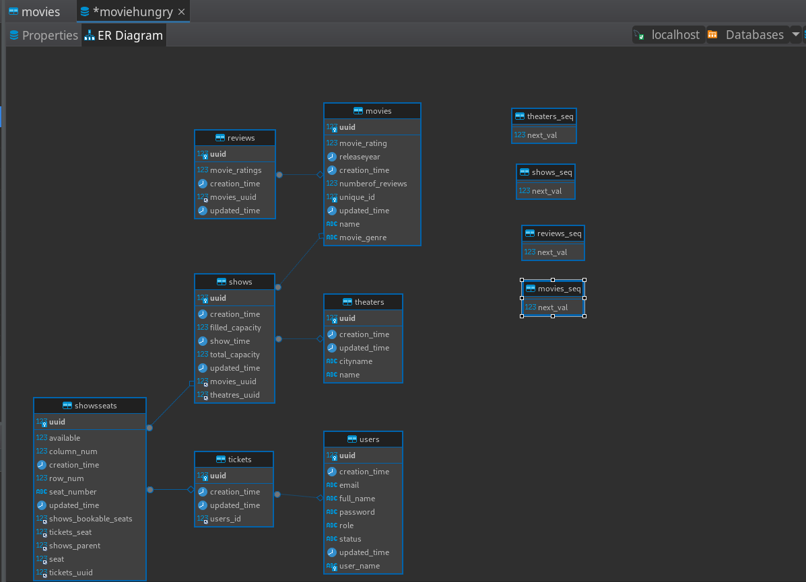

## Movie Review Service Backend REST API

 ---

This project is a backend REST API for a movie review service built using Spring Boot, JPA Hibernate, and MySQL. It allows users to manage movie reviews, theaters, and showtimes.

---
## Brief about Architecture
- lets start with the RDMS schema design
  

### Installation
Before running the application, ensure you have the following prerequisites installed:

- Java Development Kit (JDK) 11 or higher
- Maven
- MySQL database
- In case you dont have mysql it have support for h2 in-memory database
---
Follow these steps to set up and run the application:
---
Clone the repository:

~~~
git clone https://github.com/your-username/movie-review-service.git
~~~
Navigate to the project directory:

~~~
cd movie-review-service
~~~
Configure the database:

Open the application.properties file located in src/main/resources.
Update the database connection properties such as spring.datasource.url, spring.datasource.username, and spring.datasource.password according to your MySQL database configuration.
Build the project:

~~~
mvn clean install
~~~
Run the application:

~~~
mvn spring-boot:run
~~~
The application should now be up and running on http://localhost:8080.

---
**Documentation**
- ```http://localhost:9090/swagger-ui/index.html``` to see all the API endpoints docs and actuator endpoints
---
**Usage**
- Once the application is running, this is a restfull API service running using http protocol so use some HTTP client like Postman or cURL to interact with the REST API endpoints. 
Here are some of the available endpoints:

**Available endpoints**

_there is a ```.postman-collection.json``` file linked to this project feel free to test this endpoints_

---
## Future upgrade scopes
- more compact response structure 
- implement caching using Redis or memcached
- code readability and more compact code quality
- add Pagination support for some data heavy endpoints
- test cases like unit test irrigation test using Junit and Mockito
- Spring Security using session cookies and JWT (major)
- implement ACL setup (Major feature)
- try to implement https try doing self certified certifications
---
### Contributing
- Contributions are welcome! If you find any issues or have suggestions for improvements, please feel free to open an issue or submit a pull request.
